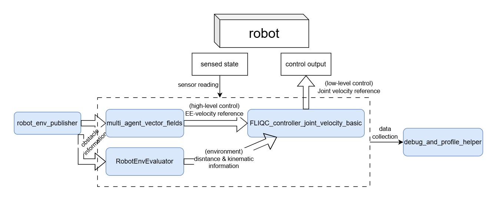

# FLIQC_example_workspace_ros

This repository provides a complete ROS workspace for experimenting with the FLIQC (Fast LInear Quadratic Complementarity) motion planner and related robot control tools. It integrates several submodules for robot control, environment evaluation, and scene publishing, enabling simulation, profiling, and real robot experiments.

There are several important packages and submodules in this workspace:
- **src/fliqc_controller_ros**: ROS package wrapping the FLIQC controller, providing simulation, profiling, and real robot workflows.
- **src/fliqc_controller_ros/submodule/FLIQC_controller_core**: Core C++ library implementing the FLIQC motion planner.
- **src/fliqc_controller_ros/submodule/robot_env_evaluator**: C++ library for evaluating robot kinematics and environment geometry.
- **src/robot_env_publisher**: ROS package for publishing dynamic obstacle environments from YAML scene files.
- **src/multi_agent_vector_fields**: ROS package for multi-agent vector field planning, used to guide the velocity of the FLIQC controller.

There are also several utility packages:
- **src/debug_and_profile_helper**: A ROS package providing debugging and profiling tools for the FLIQC controller.
- **src/franka_ros**: ROS package for interfacing with the Franka Emika Panda robot.



## Installation

Clone the repository with all submodules:

```bash
git clone --recursive https://github.com/hwyao/FLIQC_example_workspace_ros.git
cd FLIQC_example_workspace_ros
```

Install dependencies (from the workspace root):

```bash
rosdep install --from-paths src --ignore-src -r -y
```

Build the workspace (recommended with Release flag):

```bash
catkin build -DCMAKE_BUILD_TYPE=Release
```

Source the workspace:

```bash
source devel/setup.bash
```

## Quick Start

You can now launch various controllers and environment publishers. For example, to run a simulation with the FLIQC controller:

```bash
roslaunch fliqc_controller_ros sim_fliqc_joint_velocity_standard.launch env_scene:=<scene_name>
```

Refer to the `fliqc_controller_ros` [package documentation](https://github.com/hwyao/fliqc_controller_ros) for more details on available launch files and parameters.

## Documentation

- [fliqc_controller_ros Repository](https://github.com/hwyao/fliqc_controller_ros)
- [FLIQC_controller_core Documentation](https://hwyao.github.io/projects-documentation/FLIQC_controller_core/index.html)
- [robot_env_evaluator Documentation](https://hwyao.github.io/projects-documentation/robot_env_evaluator/index.html)
- [multi_agent_vector_fields Repository](https://github.com/riddhiman13/multi_agent_vector_fields)
- [robot_env_publisher Repository](https://github.com/hwyao/robot_env_publisher)

## License

This main repository is licensed under the MIT License. 
See individual submodules for license information. 